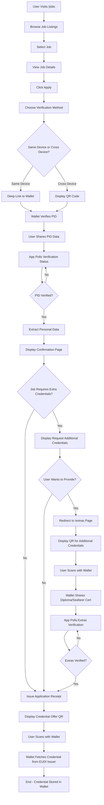
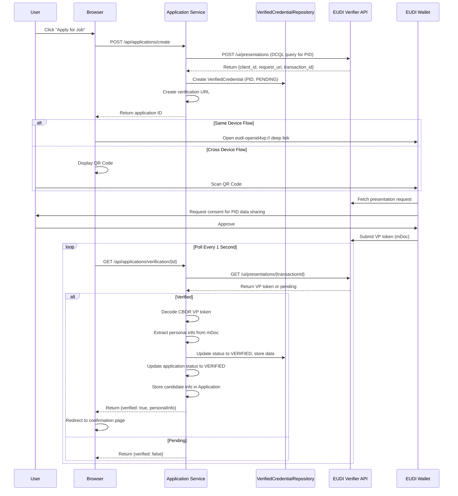
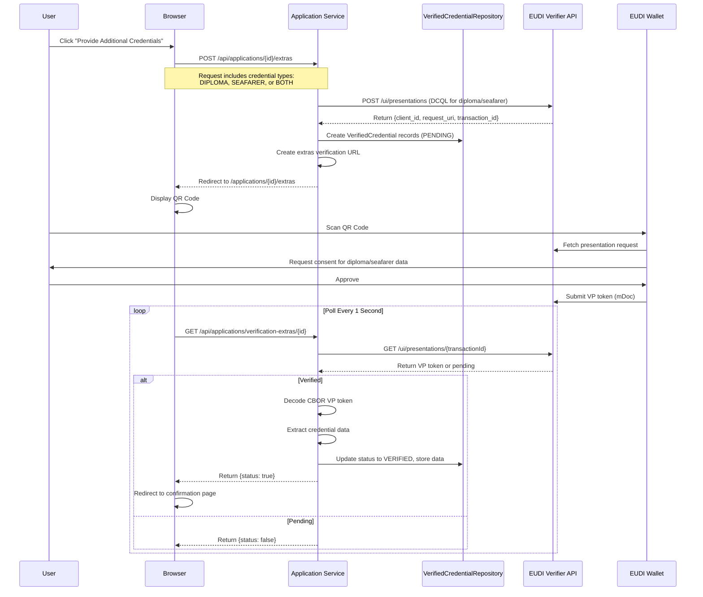
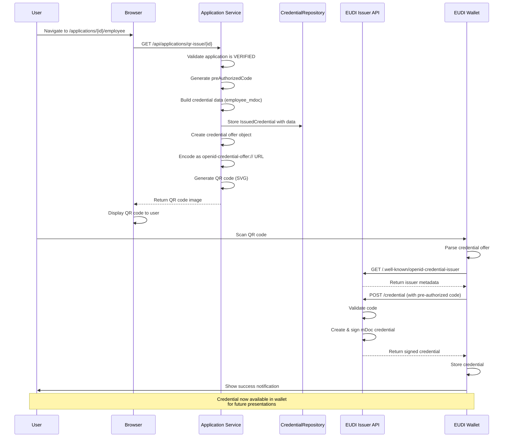
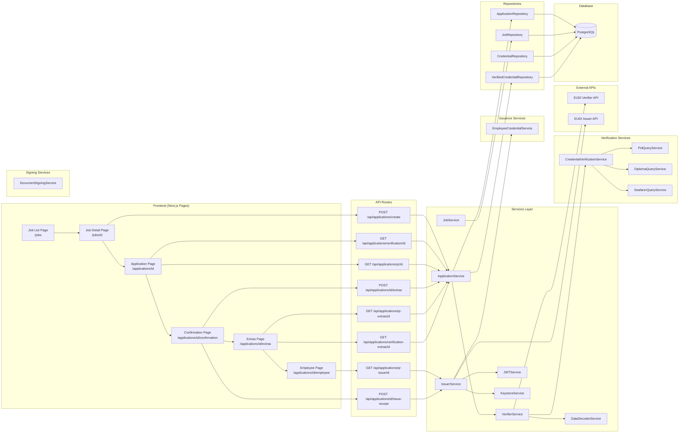
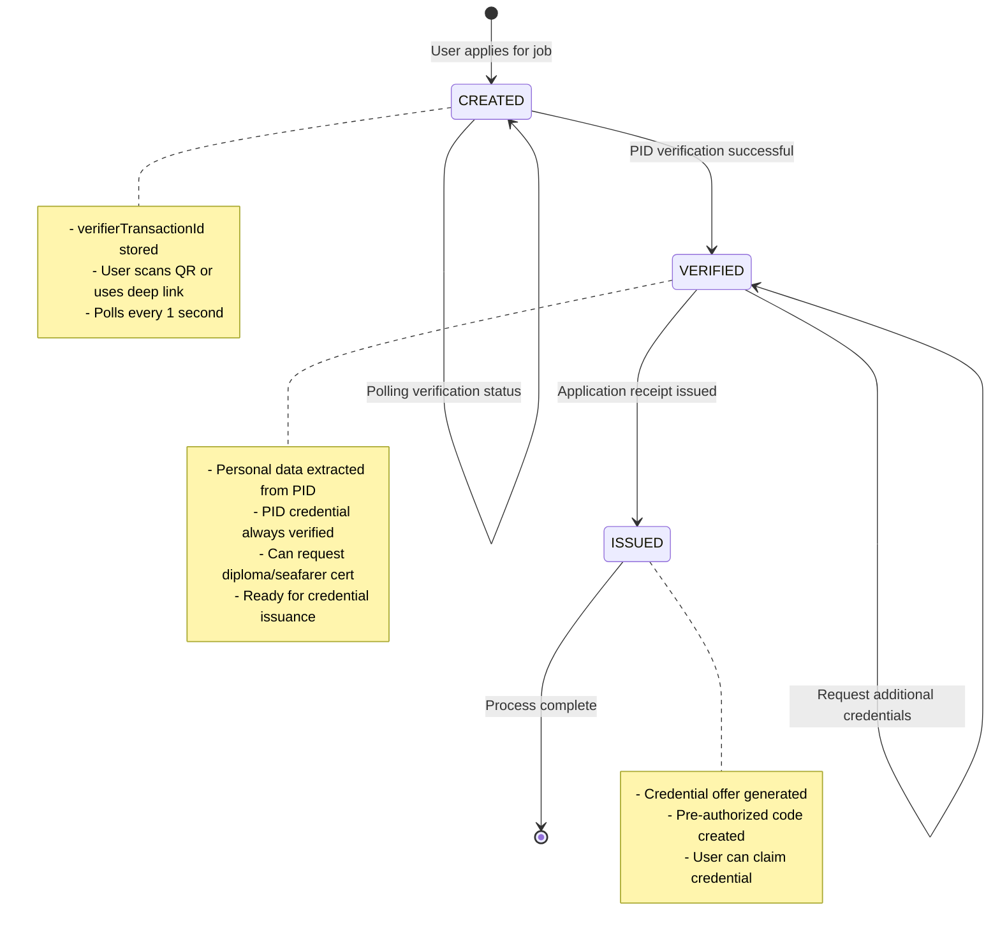
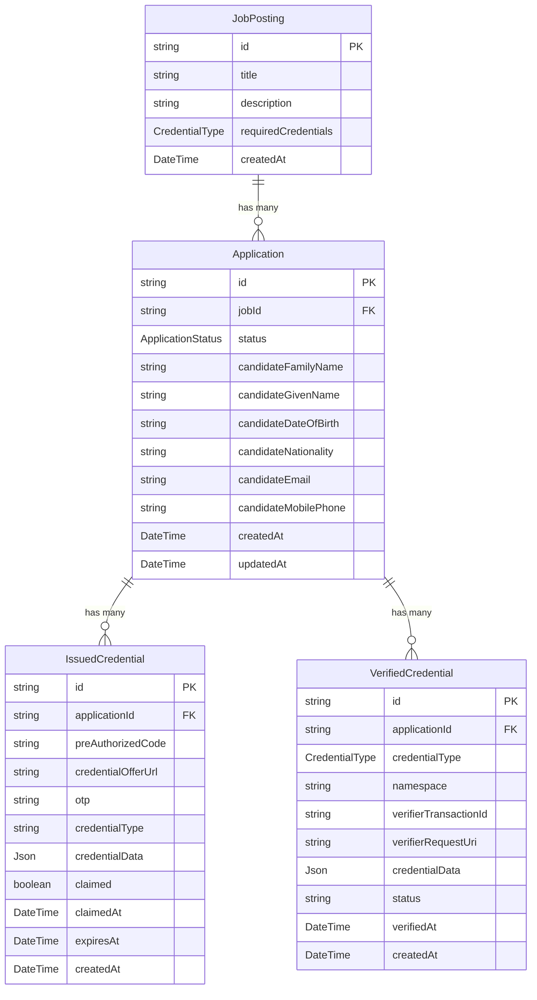
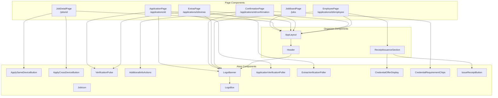
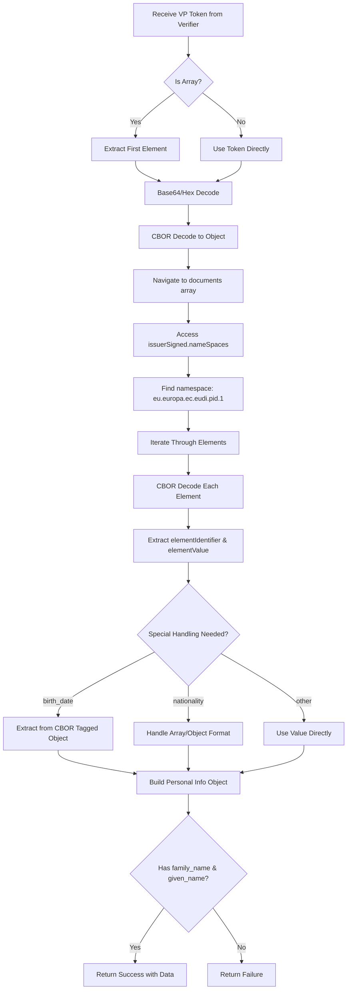

# EUDI Web Recruitment Service - Application Flowcharts

## 1. Overall Application Flow

## 2. PID Verification Flow (Detail)

## 3. Additional Credentials Verification Flow (Extras)

## 4. Credential Issuance Flow

## 5. Data Flow Architecture

## 6. Application State Machine

## 7. Database Schema Relationships

## 8. Component Architecture

## 9. CBOR Decoding Flow (VP Token Processing)

## Key Points

### Verification Flow

- Uses **DCQL (Distributed Credential Query Language)** to request specific credential fields
- Supports both **same-device** (deep link) and **cross-device** (QR code) flows
- **Polls** verification status every 1 second for both PID and extras
- Decodes **CBOR-encoded mDoc** VP tokens to extract personal information
- Stores all verified credentials in **VerifiedCredential** table with status tracking
- Supports multiple credential types: **PID** (always required), **DIPLOMA**, and **SEAFARER** (optional)

### Two-Stage Verification Process

1. **Initial PID Verification**: Required for all applications
   - Creates Application with CREATED status
   - Stores PID verification transaction in VerifiedCredential table
   - Updates Application to VERIFIED status on success
   - Extracts candidate personal data (name, DOB, nationality, email, phone)

2. **Optional Extras Verification**: For jobs requiring additional credentials
   - User can choose to provide diploma and/or seafarer certificate
   - Creates separate VerifiedCredential records for each credential type
   - Each credential has its own verification transaction and status
   - Verification happens on separate `/extras` page with new QR code

### Credential Issuance Flow

- Stores application data locally but uses **external EUDI issuer** for actual credential creation
- Uses **pre-authorized code** grant type (OpenID4VCI)
- Generates QR codes for wallet scanning
- Credential offer points to `dev.issuer.eudiw.dev`
- Stores issued credentials in **IssuedCredential** table with tracking

### Architecture Pattern

- **Clean Architecture** with clear separation of concerns
- **Dependency Injection** using TypeDI
- **Repository Pattern** for data access with 4 repositories:
  - ApplicationRepository
  - JobRepository
  - CredentialRepository (for issued credentials)
  - VerifiedCredentialRepository (for verified credentials from wallet)
- **Service Layer** organized by domain:
  - **Verification Services** (`/services/verification/`):
    - `CredentialVerificationService` - Orchestrates verification workflows
    - `PidQueryService` - Builds DCQL queries for PID credentials
    - `DiplomaQueryService` - Builds DCQL queries for diploma credentials
    - `SeafarerQueryService` - Builds DCQL queries for seafarer credentials
  - **Issuance Services** (`/services/issuance/`):
    - `EmployeeCredentialService` - Builds employee credential data
  - **Signing Services** (`/services/signing/`):
    - `DocumentSigningService` - Handles document signing workflows (QES)
  - **Core Services**:
    - `ApplicationService` - Orchestrates application lifecycle
    - `VerifierService` - EUDI verifier API integration
    - `IssuerService` - EUDI issuer API integration
    - `DataDecoderService` - CBOR/VP token decoding
    - `JWTService` - JWT signing
    - `KeystoreService` - Keystore management
- **Input Validation** using Zod schemas with decorators
