# EUDI Web Recruitment Service - Application Flowcharts

## Table of Contents

1. [Overall Application Flow](#1-overall-application-flow)
2. [Hexagonal Architecture & Data Flow](#2-hexagonal-architecture--data-flow)
3. [Value Objects in Action](#3-value-objects-in-action)
4. [Device Detection Flow](#4-device-detection-flow)
5. [PID Verification Flow (Detail)](#5-pid-verification-flow-detail)
6. [Additional Credentials Verification Flow](#6-additional-credentials-verification-flow)
7. [Document Signing Flow (QES)](#7-document-signing-flow-qes)
8. [Credential Issuance Flow](#8-credential-issuance-flow)
9. [Data Flow Architecture](#9-data-flow-architecture)
10. [Application State Machine](#10-application-state-machine)
11. [Database Schema Relationships](#11-database-schema-relationships)
12. [Component Architecture](#12-component-architecture)
13. [CBOR Decoding Flow (VP Token Processing)](#13-cbor-decoding-flow-vp-token-processing)
14. [Key Points](#key-points)

## 1. Overall Application Flow

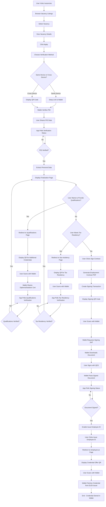

## 2. Hexagonal Architecture & Data Flow

### Architectural Layers

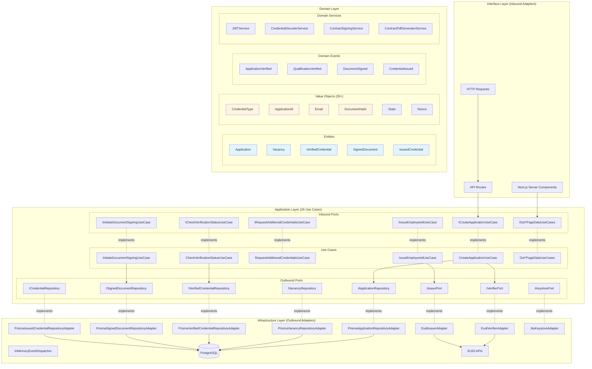

### Data Flow with Value Objects

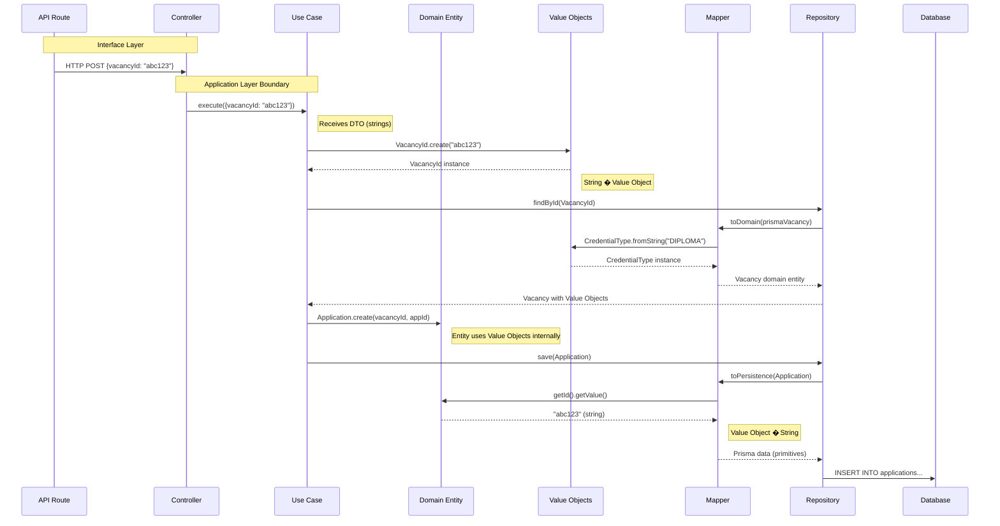

## 3. Value Objects in Action

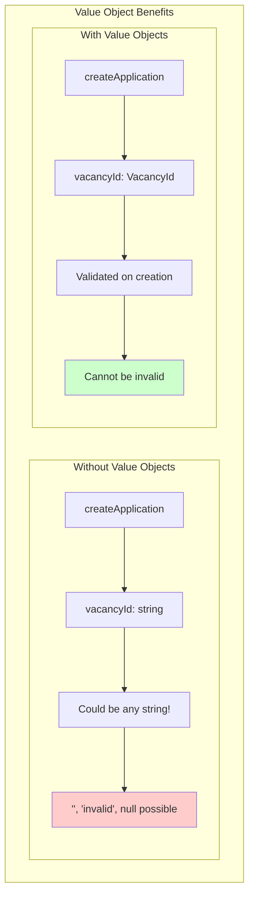

### Value Object Creation Flow

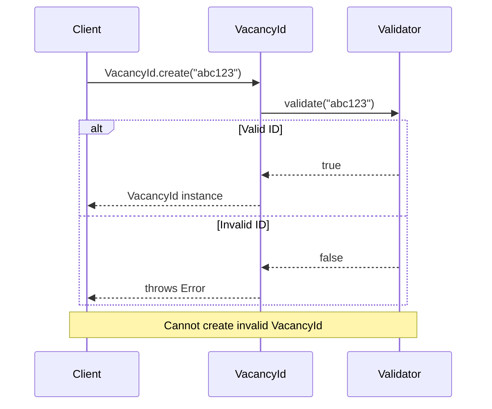

## 4. Device Detection Flow

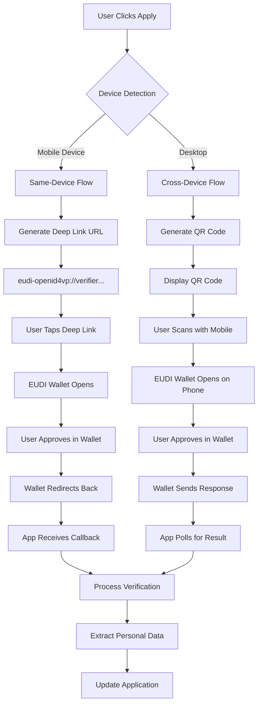

### Page-Specific Use Cases

The application follows hexagonal architecture with dedicated use cases for each page:

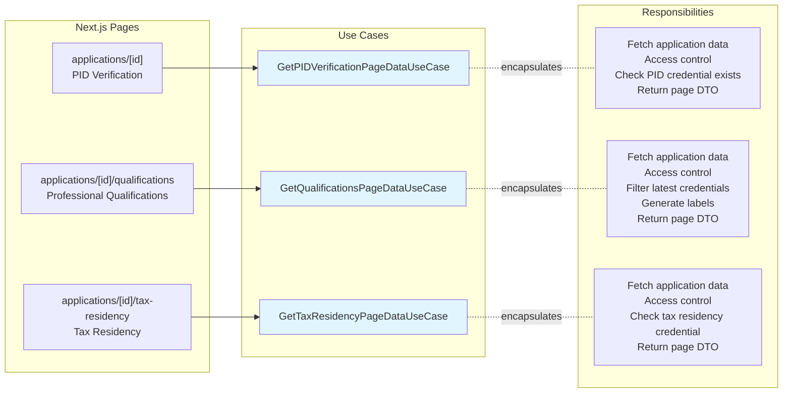

**Benefits**:

- **Encapsulation**: All page logic in dedicated use cases
- **Testability**: Easy to test business logic without HTTP layer
- **Composition**: Use cases can call other use cases internally
- **Clean separation**: Pages handle HTTP, use cases handle business logic

## 5. PID Verification Flow (Detail)

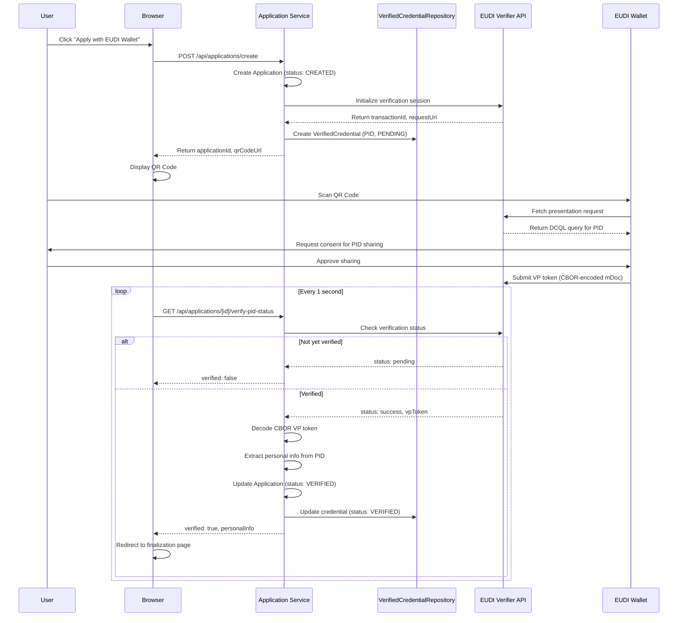

## 6. Additional Credentials Verification Flow

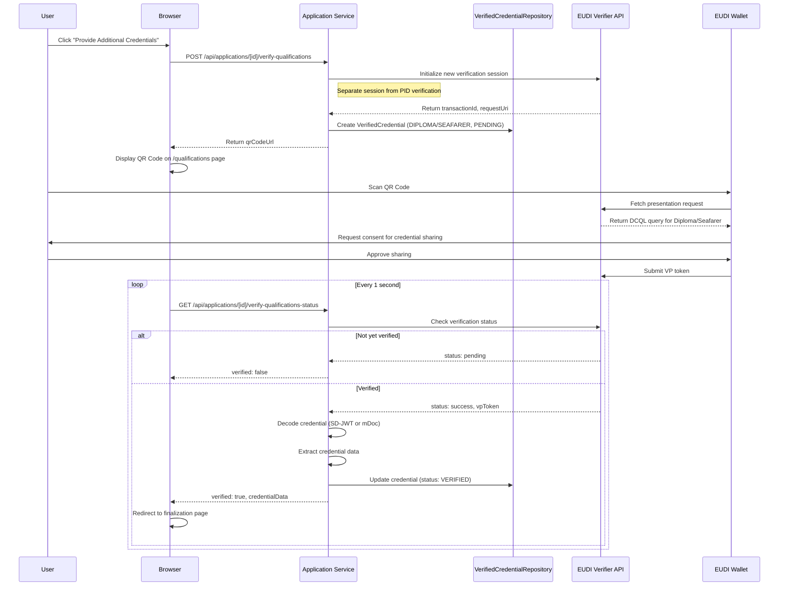

## 7. Document Signing Flow (QES)

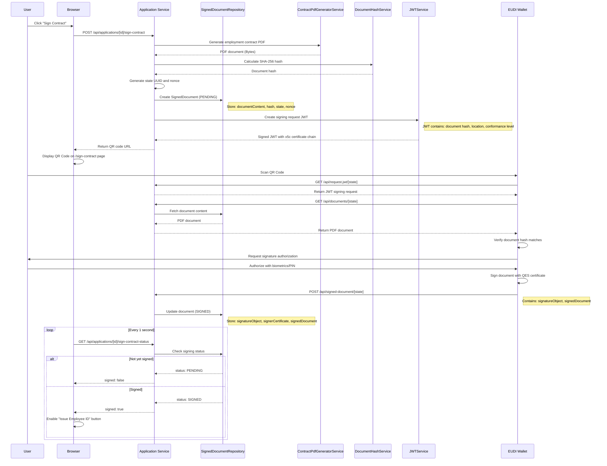

## 8. Credential Issuance Flow

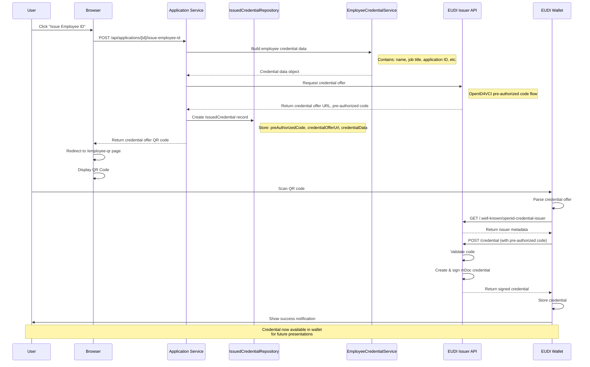

## 9. Data Flow Architecture

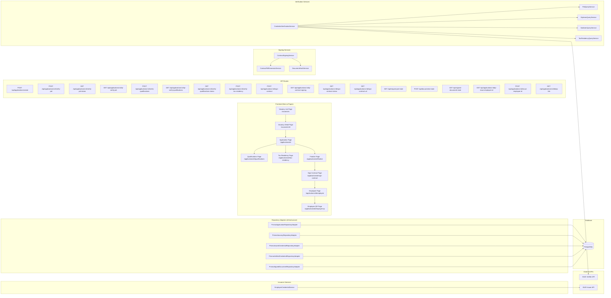

## 10. Application State Machine

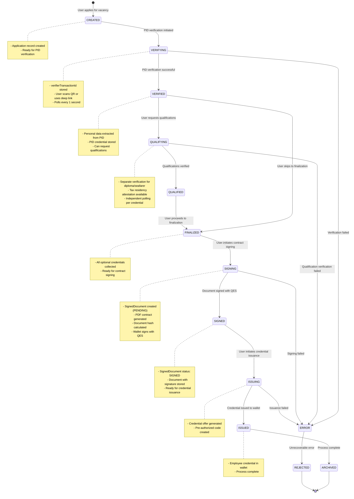

## 11. Database Schema Relationships

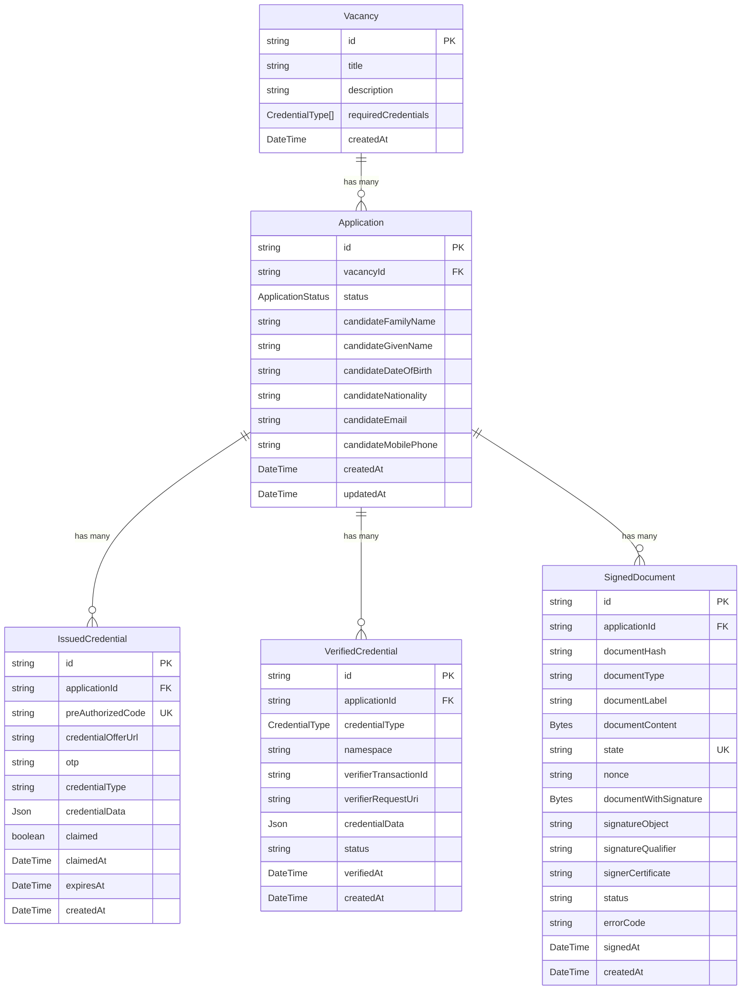

## 12. Component Architecture

Following **Atomic Design** principles: Pages � Organisms � Molecules � Atoms

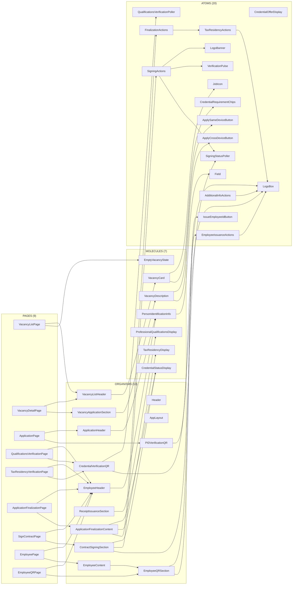

## 13. CBOR Decoding Flow (VP Token Processing)

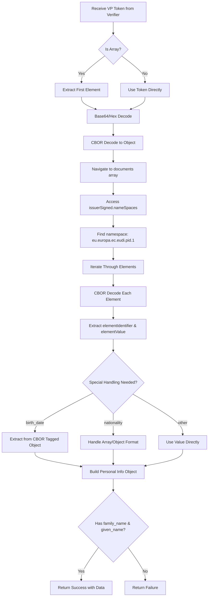

## 14. Key Points

### Architecture Overview

- **Hexagonal Architecture** (Ports & Adapters) with **Domain-Driven Design (DDD)**
- **26 Use Cases** implementing business logic
- **5 Prisma Repository Adapters** for data persistence
- **2 HTTP Adapters** for EUDI Verifier and Issuer integration
- **Domain Events** for loose coupling (ApplicationVerified, QualificationVerified, DocumentSigned, CredentialIssued)
- **30+ Value Objects** for type-safe domain modeling
- **TypeDI** for dependency injection

### Verification Flow

- Uses **DCQL (Distributed Credential Query Language)** to request specific credential fields
- Supports both **same-device** (deep link) and **cross-device** (QR code) flows
- **Polls** verification status every 1 second for both PID and qualifications
- **Decodes multiple credential formats**:
  - **CBOR-encoded mDoc** (ISO/IEC 18013-5) VP tokens to extract personal information
  - **SD-JWT** (Selective Disclosure JWT) for privacy-preserving credential verification
- Stores all verified credentials in **VerifiedCredential** table with status tracking
- Supports multiple credential types: **PID** (always required), **DIPLOMA**, **SEAFARER**, and **TAXRESIDENCY** (optional)

### Multi-Stage Verification Process

1. **Initial PID Verification**: Required for all applications
   - Creates Application with CREATED status, transitions to VERIFYING
   - Stores PID verification transaction in VerifiedCredential table
   - Updates Application to VERIFIED status on success
   - Extracts candidate personal data (name, DOB, nationality, email, phone)

2. **Optional Professional Qualifications**: For jobs requiring additional credentials
   - User can choose to provide diploma and/or seafarer certificate
   - Application transitions to QUALIFYING status
   - Creates separate VerifiedCredential records for each credential type
   - Each credential has its own verification transaction and status
   - Verification happens on `/qualifications` page with dedicated QR code
   - On success, application transitions to QUALIFIED status

3. **Optional Tax Residency Attestation**: Available on finalization page
   - Requested before contract signing
   - Stores tax residency attestation in VerifiedCredential table
   - Separate verification flow with its own QR code
   - Available on `/tax-residency` page

### Application Status States

```
CREATED � VERIFYING � VERIFIED � QUALIFYING � QUALIFIED � FINALIZED � SIGNING � SIGNED � ISSUING � ISSUED � ARCHIVED
                  �                                                            �
                    ERROR � REJECTED
```

### Document Signing Flow (QES)

- Implements **Qualified Electronic Signature (QES)** using EUDI Wallet integration
- **Required step** before employee credential issuance
- Application transitions from FINALIZED � SIGNING � SIGNED
- **Contract Generation**:
  - Generates professional PDF employment contract using pdf-lib
  - Includes candidate information and job details
  - Calculates SHA-256 hash of document for integrity verification
- **Signing Process**:
  - Creates unique signing transaction with state UUID and nonce
  - Stores document content in **SignedDocument** table with PENDING status
  - Generates QR code with `eudi-openid4vp://` URL containing request_uri
  - Wallet retrieves signed JWT from `/api/request.jwt/{state}` endpoint
  - Wallet downloads document from `/api/documents/{state}` endpoint
  - Wallet verifies document hash matches
  - User authorizes and signs with Qualified Electronic Signature
  - Wallet posts signed document to `/api/signed-document/{state}` (direct_post mode)
- **Status Tracking**:
  - Browser polls `/api/applications/[id]/sign-contract-status` every 1 second
  - SignedDocument status: PENDING � SIGNED (or FAILED on error)
  - Signed document with signature stored in database
  - "Issue Employee ID" button enabled only after successful signing
- **Security**:
  - Uses JWT with x5c certificate chain (ES256 algorithm)
  - Document hash verification ensures integrity
  - Signature qualifier: `eu_eidas_qes` (eIDAS Qualified Electronic Signature)
  - Hash algorithm: SHA-256 (OID: 2.16.840.1.101.3.4.2.1)

### Credential Issuance Flow

- Application transitions from SIGNED � ISSUING � ISSUED
- Stores application data locally but uses **external EUDI issuer** for actual credential creation
- Uses **pre-authorized code** grant type (OpenID4VCI)
- Generates QR codes for wallet scanning on `/employee-qr` page
- Credential offer points to `dev.issuer.eudiw.dev`
- Stores issued credentials in **IssuedCredential** table with tracking
- **Only available after** contract has been signed with QES
- On completion, application can be transitioned to ARCHIVED status
