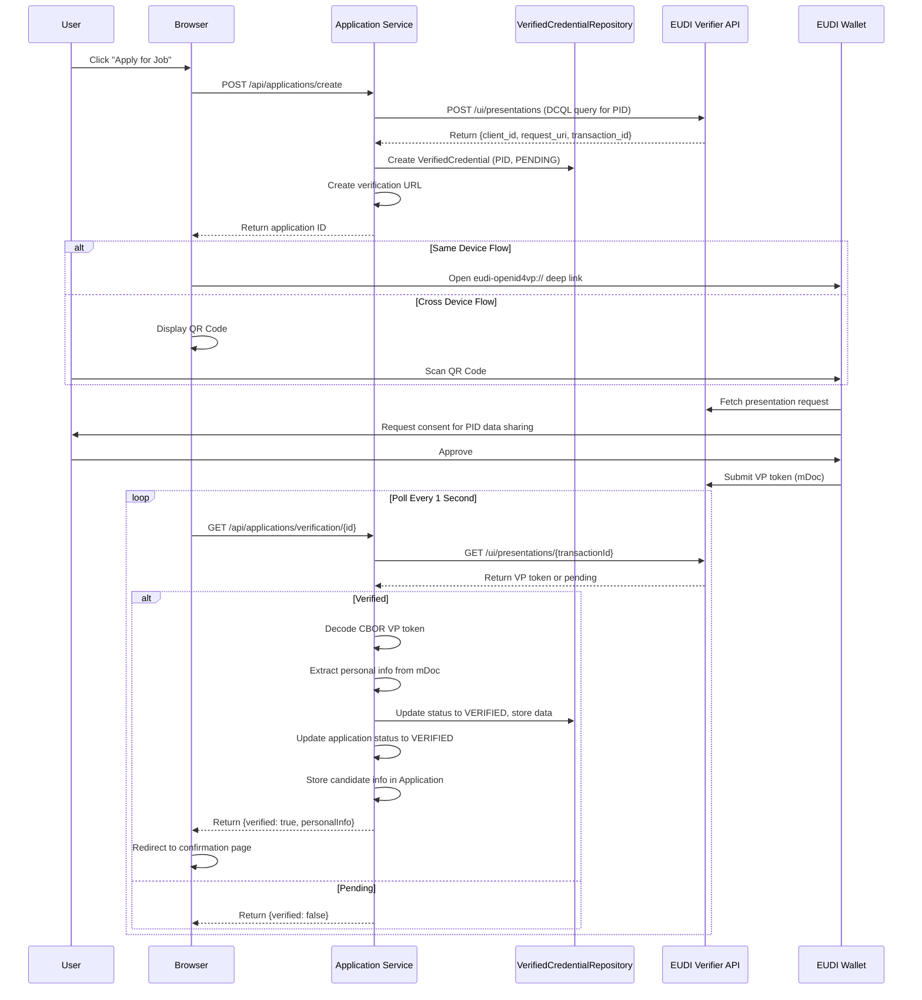
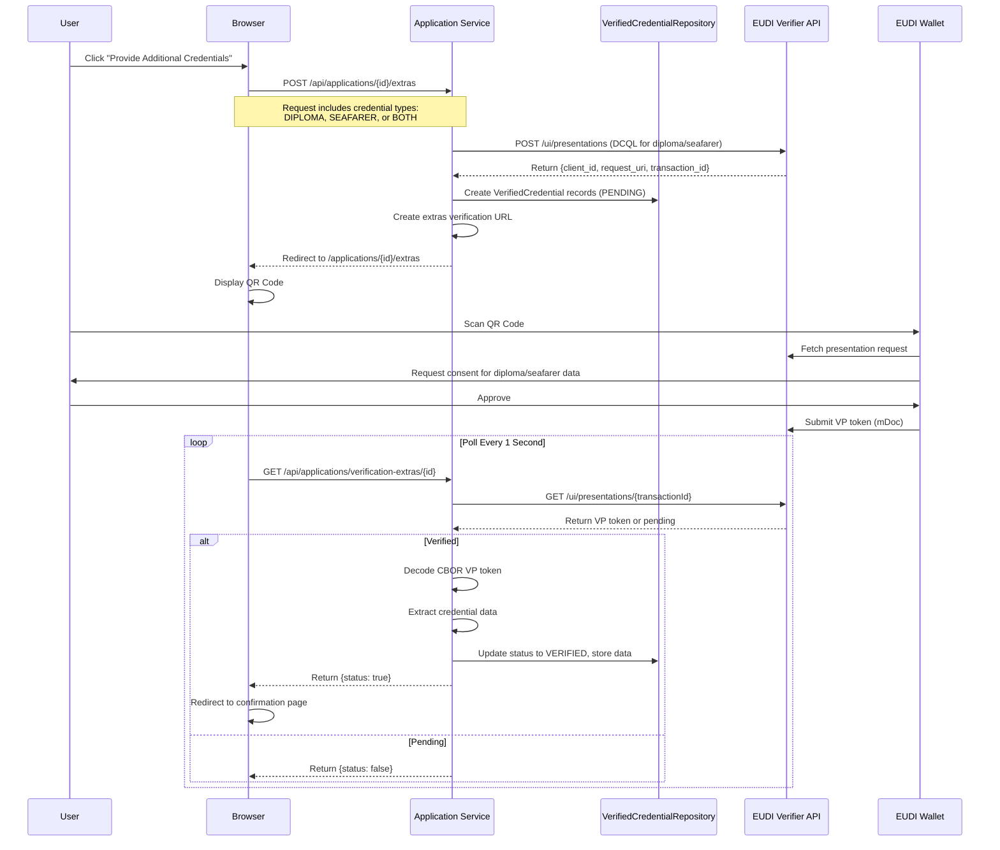
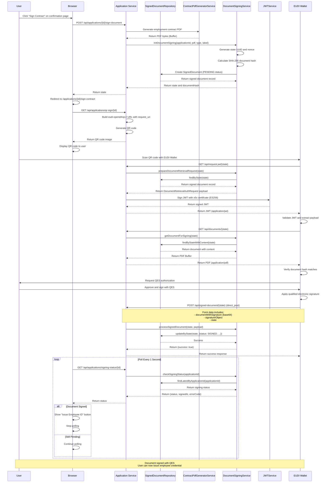
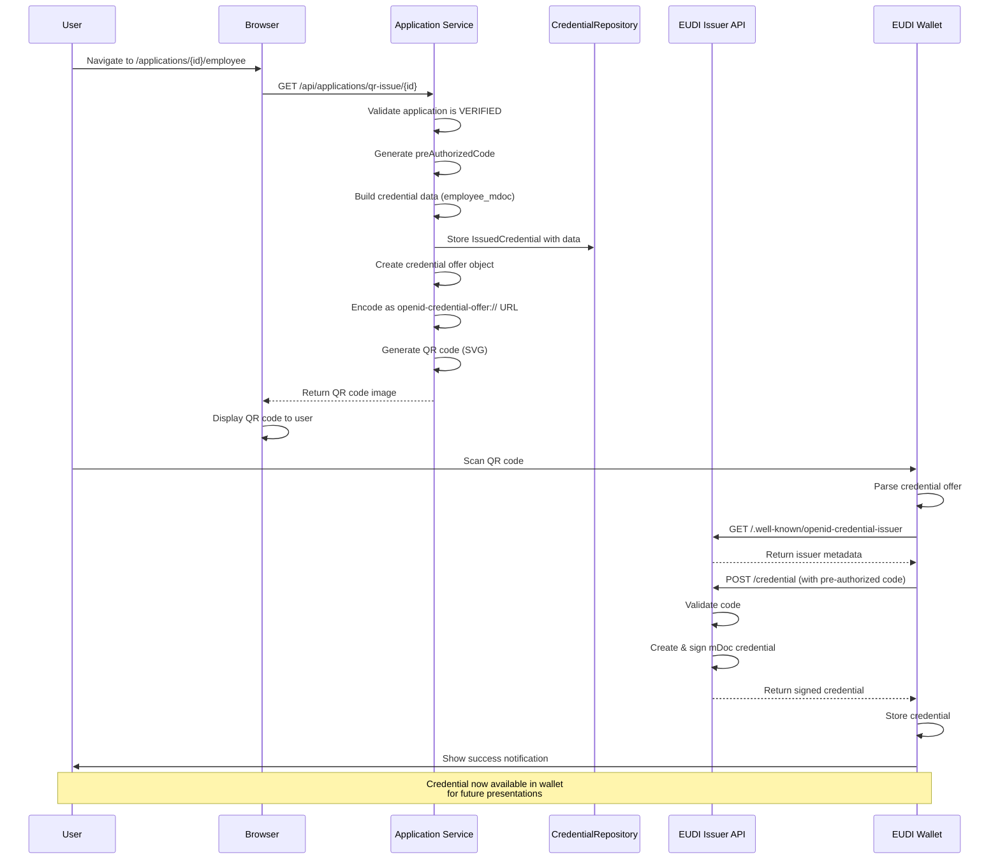
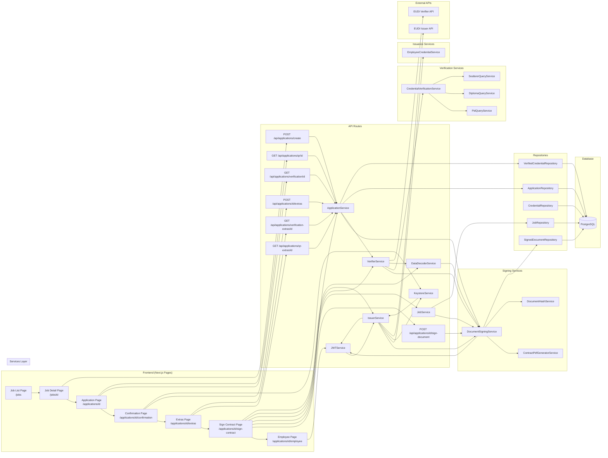
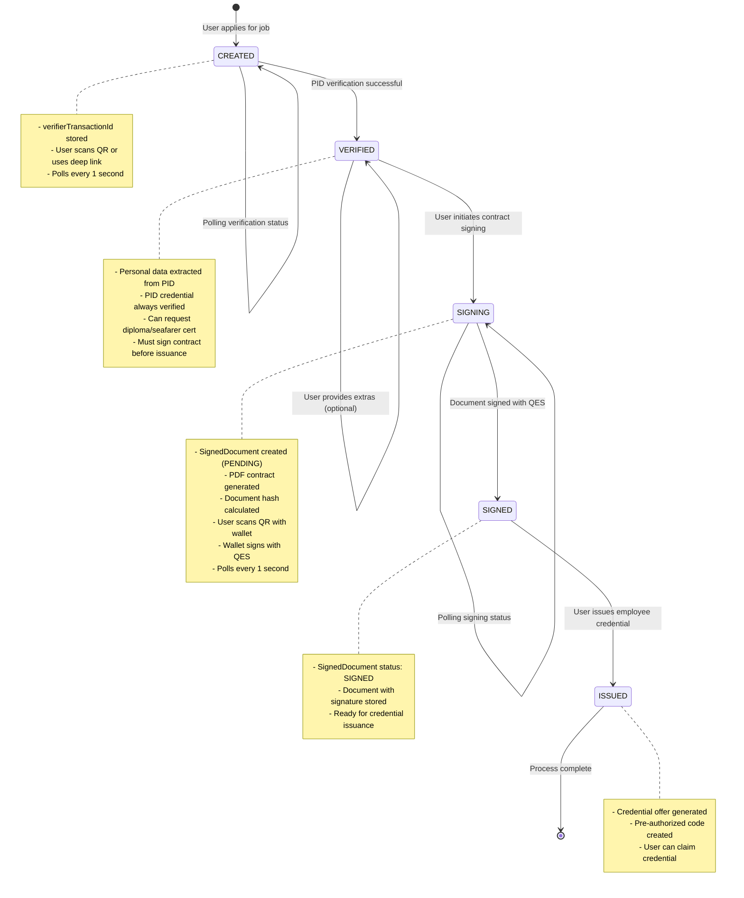
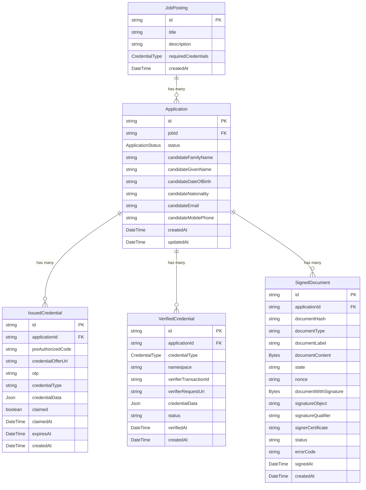
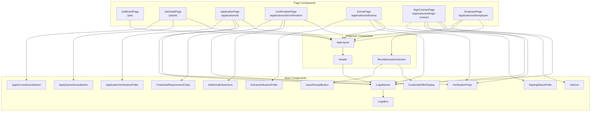
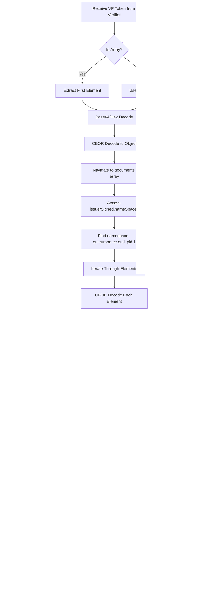

# EUDI Web Recruitment Service - Application Flowcharts

## 1. Overall Application Flow

```mermaid
graph TD
    A[User Visits /jobs] --> B[Browse Job Listings]
    B --> C[Select Job]
    C --> D[View Job Details]
    D --> E[Click Apply]
    E --> F[Choose Verification Method]
    F --> G{Same Device or Cross Device?}
    G -->|Same Device| H[Deep Link to Wallet]
    G -->|Cross Device| I[Display QR Code]
    H --> J[Wallet Verifies PID]
    I --> J
    J --> K[User Shares PID Data]
    K --> L[App Polls Verification Status]
    L --> M{PID Verified?}
    M -->|Yes| N[Extract Personal Data]
    M -->|No| L
    N --> O[Display Confirmation Page]
    O --> P{User Wants to Provide Extras?}
    P -->|Yes| Q[Redirect to /extras Page]
    P -->|No| R[User Clicks Sign Contract]
    Q --> T[Display QR for Additional Credentials]
    T --> U[User Scans with Wallet]
    U --> V[Wallet Shares Diploma/Seafarer Cert]
    V --> W[App Polls Extras Verification]
    W --> X{Extras Verified?}
    X -->|Yes| O
    X -->|No| W
    R --> Y[Generate Employment Contract PDF]
    Y --> Z[Create Signing Transaction]
    Z --> AA[Display Signing QR Code]
    AA --> AB[User Scans with Wallet]
    AB --> AC[Wallet Requests Signing JWT]
    AC --> AD[Wallet Downloads Document]
    AD --> AE[User Signs with QES]
    AE --> AF[Wallet Posts Signed Document]
    AF --> AG[App Polls Signing Status]
    AG --> AH{Document Signed?}
    AH -->|Yes| AI[Enable Issue Employee ID]
    AH -->|No| AG
    AI --> AJ[User Clicks Issue Employee ID]
    AJ --> AK[Display Credential Offer QR]
    AK --> AL[User Scans with Wallet]
    AL --> AM[Wallet Fetches Credential from EUDI Issuer]
    AM --> AN[End - Credential Stored in Wallet]
```

## 2. PID Verification Flow (Detail)

## 3. Additional Credentials Verification Flow (Extras)

## 4. Document Signing Flow (QES)

## 5. Credential Issuance Flow

## 6. Data Flow Architecture

## 7. Application State Machine

## 8. Database Schema Relationships

## 9. Component Architecture

## 10. CBOR Decoding Flow (VP Token Processing)

## Key Points

### Verification Flow

- Uses **DCQL (Distributed Credential Query Language)** to request specific credential fields
- Supports both **same-device** (deep link) and **cross-device** (QR code) flows
- **Polls** verification status every 1 second for both PID and extras
- Decodes **CBOR-encoded mDoc** VP tokens to extract personal information
- Stores all verified credentials in **VerifiedCredential** table with status tracking
- Supports multiple credential types: **PID** (always required), **DIPLOMA**, and **SEAFARER** (optional)

### Two-Stage Verification Process

1. **Initial PID Verification**: Required for all applications
   - Creates Application with CREATED status
   - Stores PID verification transaction in VerifiedCredential table
   - Updates Application to VERIFIED status on success
   - Extracts candidate personal data (name, DOB, nationality, email, phone)

2. **Optional Extras Verification**: For jobs requiring additional credentials
   - User can choose to provide diploma and/or seafarer certificate
   - Creates separate VerifiedCredential records for each credential type
   - Each credential has its own verification transaction and status
   - Verification happens on separate `/extras` page with new QR code

### Document Signing Flow (QES)

- Implements **Qualified Electronic Signature (QES)** using EUDI Wallet integration
- **Required step** before employee credential issuance
- **Contract Generation**:
  - Generates professional PDF employment contract using pdf-lib
  - Includes candidate information and job details
  - Calculates SHA-256 hash of document for integrity verification
- **Signing Process**:
  - Creates unique signing transaction with state UUID and nonce
  - Stores document content in **SignedDocument** table with PENDING status
  - Generates QR code with `eudi-openid4vp://` URL containing request_uri
  - Wallet retrieves signed JWT from `/api/request.jwt/{state}` endpoint
  - Wallet downloads document from `/api/documents/{state}` endpoint
  - Wallet verifies document hash matches
  - User authorizes and signs with Qualified Electronic Signature
  - Wallet posts signed document to `/api/signed-document/{state}` (direct_post mode)
- **Status Tracking**:
  - Browser polls `/api/applications/signing-status/{id}` every 1 second
  - SignedDocument status: PENDING → SIGNED (or FAILED on error)
  - Signed document with signature stored in database
  - "Issue Employee ID" button enabled only after successful signing
- **Security**:
  - Uses JWT with x5c certificate chain (ES256 algorithm)
  - Document hash verification ensures integrity
  - Signature qualifier: `eu_eidas_qes` (eIDAS Qualified Electronic Signature)
  - Hash algorithm: SHA-256 (OID: 2.16.840.1.101.3.4.2.1)

### Credential Issuance Flow

- Stores application data locally but uses **external EUDI issuer** for actual credential creation
- Uses **pre-authorized code** grant type (OpenID4VCI)
- Generates QR codes for wallet scanning
- Credential offer points to `dev.issuer.eudiw.dev`
- Stores issued credentials in **IssuedCredential** table with tracking
- **Only available after** contract has been signed with QES

### Architecture Pattern

- **Clean Architecture** with clear separation of concerns
- **Dependency Injection** using TypeDI
- **Repository Pattern** for data access with 5 repositories:
  - ApplicationRepository
  - JobRepository
  - CredentialRepository (for issued credentials)
  - VerifiedCredentialRepository (for verified credentials from wallet)
  - SignedDocumentRepository (for document signing workflows)
- **Service Layer** organized by domain:
  - **Verification Services** (`/services/verification/`):
    - `CredentialVerificationService` - Orchestrates verification workflows
    - `PidQueryService` - Builds DCQL queries for PID credentials
    - `DiplomaQueryService` - Builds DCQL queries for diploma credentials
    - `SeafarerQueryService` - Builds DCQL queries for seafarer credentials
  - **Issuance Services** (`/services/issuance/`):
    - `EmployeeCredentialService` - Builds employee credential data
  - **Signing Services** (`/services/signing/`):
    - `DocumentSigningService` - Orchestrates document signing workflows (QES)
    - `ContractPdfGeneratorService` - Generates professional PDF employment contracts
    - `DocumentHashService` - Calculates SHA-256 document hashes
  - **Core Services**:
    - `ApplicationService` - Orchestrates application lifecycle
    - `VerifierService` - EUDI verifier API integration
    - `IssuerService` - EUDI issuer API integration
    - `DataDecoderService` - CBOR/VP token decoding
    - `JWTService` - JWT signing with x5c certificates
    - `KeystoreService` - Keystore management
- **Input Validation** using Zod schemas with decorators
